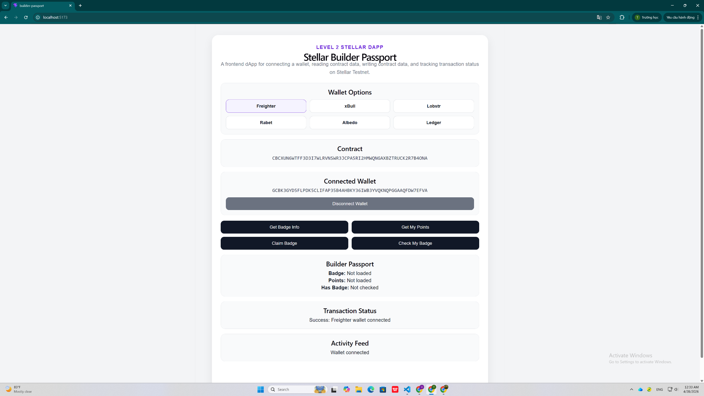
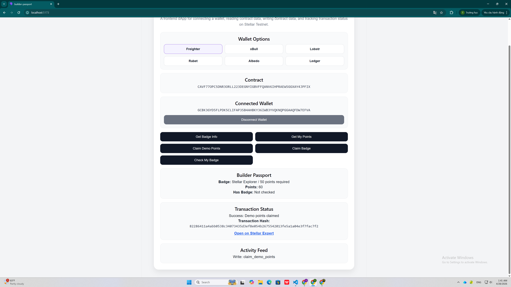

# Stellar Builder Passport - Level 2

Stellar Builder Passport is a Level 2 Stellar dApp built on Stellar Testnet.

The project allows a builder to connect a Stellar wallet, claim demo points, view badge progress, claim a badge, and track transaction status directly from the frontend.

---

## Project Overview

This project demonstrates a simple on-chain builder passport system.

A builder can:

- Connect a Stellar wallet
- View available wallet options
- Read badge information from the smart contract
- Claim demo points
- Claim a badge after reaching enough points
- Check badge ownership status
- View transaction status and transaction hash in the app

This project was built for Stellar Level 2, focusing on wallet integration, frontend contract calls, read/write contract interaction, and transaction status tracking.

---

## Level 2 Requirements Covered

### Multi-wallet UI

The frontend displays multiple wallet options:

- Freighter
- xBull
- Lobstr
- Rabet
- Albedo
- Ledger

For this build, Freighter is used as the active wallet for signing Stellar Testnet transactions.

### Contract deployed on testnet

The Soroban smart contract was deployed on Stellar Testnet.

### Contract called from frontend

The frontend calls contract functions directly from the UI.

Read functions:

- `get_badge`
- `get_points`
- `has_badge`

Write functions:

- `claim_demo_points`
- `claim_badge`

### Transaction status visible

The app displays transaction status directly in the UI:

- Pending
- Success
- Failed

Successful contract calls also display:

- Transaction hash
- Stellar Expert transaction link

### Error handling

The app handles common errors such as:

- Wallet not found or wallet not connected
- User rejected transaction
- Not enough points or invalid contract state
- Already completed actions

---

## Deployed Contract

Network:

```txt
Stellar Testnet
```

Contract ID:

```txt
CAVF77OPC5DNR3ORLL223DEGNYIGBVFFQANV6IHPRAEW5GGXAY4JPFIX
```

The frontend reads the deployed Contract ID from the `.env` file:

```env
VITE_CONTRACT_ID=CAVF77OPC5DNR3ORLL223DEGNYIGBVFFQANV6IHPRAEW5GGXAY4JPFIX
```

---

## Transaction Hashes

### Claim Demo Points Transaction

Function called:

```txt
claim_demo_points
```

Transaction hash:

```txt
82286411a4abb0538c34073435d3ef8e054b2675542013fe5a1a04e3f7fac7f2
```

### Claim Badge Transaction

Function called:

```txt
claim_badge
```

Transaction hash:

```txt
3a7fb713b38d491be78c0100b5eddb8188ac7f1cdc089348d1ffd16be01c8d75
```

---

## Screenshots

The screenshots below are stored in the `screenshots` folder and displayed directly in this README.

### 1. Wallet Options, Contract ID, and Connected Wallet



### 2. Claim Demo Points Transaction



### 3. Claim Badge Transaction


---

## Demo Flow

The user flow is:

1. Open the app
2. Connect Freighter wallet
3. Read badge information
4. Claim demo points
5. Check wallet points
6. Claim badge
7. Check badge ownership
8. View transaction hash in the app

Expected final state:

```txt
Badge: Stellar Explorer / 50 points required
Points: 60
Has Badge: true
```

---

## Main Contract Functions

### `get_badge`

Reads badge information from the contract.

Example result:

```txt
Stellar Explorer / 50 points required
```

### `claim_demo_points`

Adds demo points to the connected wallet.

This function is used to make the frontend demo complete without needing a manual admin action.

### `get_points`

Reads the current points of the connected wallet.

### `claim_badge`

Claims the badge if the connected wallet has enough points.

### `has_badge`

Checks whether the connected wallet already owns the badge.

---

## Tech Stack

- Stellar Testnet
- Soroban Smart Contract
- React
- Vite
- Freighter Wallet
- Stellar SDK
- VSCode

---

## Project Structure

```txt
Builder Passport/
├── builder-passport-contract/
│   └── src/
│       └── lib.rs
├── screenshots/
│   ├── wallet-options-contract-connected.png
│   ├── transaction-hash-demo-points.png
│   └── transaction-hash-claim-badge.png
├── src/
│   ├── App.jsx
│   └── App.css
├── deploy-and-sync.ps1
├── package.json
├── README.md
└── .env
```

---

## Run Locally

### 1. Install dependencies

```bash
npm install
```

### 2. Create `.env`

Create a `.env` file in the project root:

```env
VITE_CONTRACT_ID=CAVF77OPC5DNR3ORLL223DEGNYIGBVFFQANV6IHPRAEW5GGXAY4JPFIX
```

### 3. Start the frontend

```bash
npm run dev
```

Open:

```txt
http://localhost:5173/
```

---

## Auto Deploy Script

This project includes an auto deploy script:

```txt
deploy-and-sync.ps1
```

The script can:

- Build the Soroban contract
- Deploy a new contract to Stellar Testnet
- Initialize the contract
- Create the default badge
- Write the new Contract ID into `.env`
- Update the frontend to read the Contract ID from `.env`

Run:

```powershell
.\deploy-and-sync.ps1
```

After running the script, restart the frontend:

```bash
npm run dev
```

---

## How to Test

After starting the app, test the dApp in this order:

1. Click `Freighter`
2. Approve wallet connection
3. Click `Get Badge Info`
4. Click `Claim Demo Points`
5. Click `Get My Points`
6. Click `Claim Badge`
7. Click `Check My Badge`

Expected result:

```txt
Points: 60
Has Badge: true
```

The app should also display the transaction hash after successful write calls.

---

## GitHub Submission Checklist

- Public GitHub repository
- README with setup instructions
- Minimum 2+ meaningful commits
- Screenshot of wallet options available
- Deployed contract address
- Transaction hash of a contract call

---

## Project Status

Level 2 requirements completed.

The dApp supports wallet connection, frontend contract calls, read/write contract interaction, visible transaction status, transaction hash display, and basic error handling.